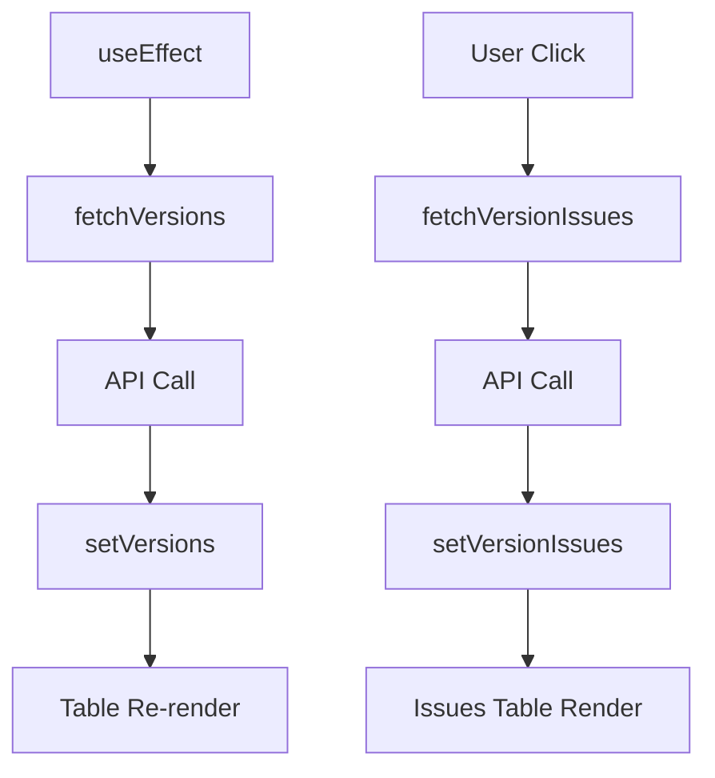

# 컴포넌트 구조

## 🎨 컴포넌트 계층 구조

```
SimpleRoadmapBoard (메인 컨테이너)
├── Sidebar (왼쪽 남색 사이드바)
│   ├── SidebarHeader
│   │   ├── Logo & Title
│   │   └── Toggle Button
│   ├── Navigation Menu
│   │   ├── 사용자 관리
│   │   ├── 일반 로그인 관리 (활성)
│   │   └── 네트워크 관리
│   └── LanguageSelector
└── MainContent (오른쪽 메인 영역)
    ├── TopHeader
    │   ├── Title & Breadcrumb
    │   └── User Actions
    ├── FilterSection
    │   ├── Version Selector
    │   └── Search Input
    ├── VersionTable (버전 목록)
    │   ├── Table Header
    │   ├── Sample Row
    │   └── Version Rows (동적)
    └── IssuesTable (선택된 버전의 이슈들)
        ├── Table Header
        └── Issue Rows (동적)
```

## 📱 컴포넌트 분석

### **SimpleRoadmapBoard** (메인 컨테이너)

**역할:**
- 전체 레이아웃 구성
- 상태 관리 중심점
- API 데이터 fetch 및 관리

**주요 State:**
```typescript
const [sidebarOpen, setSidebarOpen] = useState(true);
const [versions, setVersions] = useState<Version[]>([]);
const [selectedVersion, setSelectedVersion] = useState<Version | null>(null);
const [versionIssues, setVersionIssues] = useState<Issue[]>([]);
const [loading, setLoading] = useState(true);
const [issuesLoading, setIssuesLoading] = useState(false);
const [error, setError] = useState<string | null>(null);
```

**Props:**
```typescript
interface RoadmapBoardProps {
  projectIdentifier: string;  // 예: "2024_qa_sebj"
}
```

## 🎯 UI 섹션별 상세

### 1. **Sidebar (접이식 사이드바)**

#### **접힌 상태 (w-16)**
```tsx
<div className="w-16 bg-slate-800 text-white">
  <button onClick={() => setSidebarOpen(true)}>
    <HamburgerIcon />
  </button>
</div>
```

#### **펼쳐진 상태 (w-80)**
```tsx
<div className="w-80 bg-slate-800 text-white">
  <header>
    <Logo />
    <Title>RemoteCall v8.0 User Admin</Title>
    <CloseButton />
  </header>
  <nav>
    <MenuGroup title="전체 서비스">
      <MenuItem>사용자 관리</MenuItem>
      <MenuItem active>일반 로그인 관리</MenuItem>
      <MenuItem>네트워크 관리</MenuItem>
    </MenuGroup>
  </nav>
  <footer>
    <LanguageSelector />
  </footer>
</div>
```

### 2. **MainContent (메인 콘텐츠)**

#### **TopHeader**
```tsx
<div className="bg-white border-b px-6 py-4">
  <div className="flex justify-between">
    <div>
      <h1>일반 로그인 관리 생성법</h1>
      <p>일반 사용자 → 일반 사용자 → 일반 로그인 생성법</p>
    </div>
    <div>
      <span>사용자명</span>
      <span>내 정보보기</span>
      <SettingsIcon />
    </div>
  </div>
</div>
```

#### **FilterSection**
```tsx
<div className="p-4 bg-gray-50 border-b">
  <div className="flex space-x-4">
    <select>
      <option>전체버전 선택하세요</option>
    </select>
    <input placeholder="검색어를 입력하세요" />
    <button className="bg-blue-600 text-white">검색</button>
  </div>
</div>
```

### 3. **VersionTable (동적 데이터 테이블)**

```tsx
<table className="w-full">
  <thead className="bg-gray-50">
    <tr>
      <th>상태</th>
      <th>버전마케팅</th>
      <th>버전번호</th>
      <th>설명</th>
      <th>등록일시</th>
      <th>참고</th>
    </tr>
  </thead>
  <tbody>
    {/* 샘플 행 */}
    <tr className="bg-blue-50">
      <td>상태 종류(2002)</td>
      <td>NO</td>
      <td>버전명 마케팅</td>
      <td>상세내용</td>
      <td>설명</td>
      <td>등록일시</td>
    </tr>
    
    {/* 동적 버전 행들 */}
    {versions.map((version, index) => (
      <tr key={version.id} onClick={() => fetchVersionIssues(version)}>
        <td>{index + 1}</td>
        <td>{version.name}</td>
        <td>{version.name}</td>
        <td>
          <span className="bg-green-100 text-green-800">
            {version.status === 'open' ? '진행중' : version.status}
          </span>
        </td>
        <td>{new Date(version.created_on).toLocaleDateString('ko-KR')}</td>
        <td>
          <a href={redmineUrl} target="_blank">보기 위로</a>
        </td>
      </tr>
    ))}
  </tbody>
</table>
```

## 🔄 상태 관리 패턴

### **데이터 흐름**


### **로딩 상태 관리**
```typescript
// 버전 목록 로딩
{loading ? (
  <LoadingSpinner message="로드맵 정보를 불러오는 중..." />
) : error ? (
  <ErrorMessage error={error} />
) : (
  <VersionTable versions={versions} onVersionClick={fetchVersionIssues} />
)}

// 이슈 목록 로딩
{issuesLoading ? (
  <LoadingSpinner message="일감을 불러오는 중..." />
) : versionIssues.length === 0 ? (
  <EmptyState message="등록된 일감이 없습니다." />
) : (
  <IssuesTable issues={versionIssues} />
)}
```

## 🎨 스타일링 전략

### **Tailwind CSS 클래스 체계**

#### **색상 팔레트**
- **Primary**: `bg-blue-600`, `text-blue-600`
- **Sidebar**: `bg-slate-800`, `text-white`
- **Success**: `bg-green-100`, `text-green-800`
- **Warning**: `bg-yellow-100`, `text-yellow-800`
- **Gray Scale**: `bg-gray-50`, `text-gray-600`

#### **레이아웃 클래스**
- **Flexbox**: `flex`, `items-center`, `justify-between`
- **Grid**: `grid`, `grid-cols-6` (테이블용)
- **Spacing**: `px-4`, `py-3`, `space-x-2`
- **Border**: `border-b`, `border-gray-200`

### **반응형 디자인**
```css
/* 사이드바 너비 조정 */
.sidebar {
  @apply transition-all duration-300;
}
.sidebar.open { width: 320px; }    /* w-80 */
.sidebar.closed { width: 64px; }   /* w-16 */

/* 테이블 스크롤 */
.table-container {
  @apply overflow-x-auto;
}

/* 호버 효과 */
.table-row {
  @apply hover:bg-gray-50 cursor-pointer transition-colors;
}
```

## 🧩 컴포넌트 재사용성

### **공통 UI 컴포넌트 추출 가능**
```typescript
// Button 컴포넌트
interface ButtonProps {
  variant: 'primary' | 'secondary';
  size: 'sm' | 'md' | 'lg';
  children: React.ReactNode;
  onClick?: () => void;
}

// Table 컴포넌트
interface TableProps {
  columns: ColumnDef[];
  data: any[];
  onRowClick?: (row: any) => void;
}

// LoadingSpinner 컴포넌트
interface LoadingSpinnerProps {
  message: string;
  size?: 'sm' | 'md' | 'lg';
}
```

### **Custom Hooks 추출**
```typescript
// useVersions Hook
function useVersions(projectId: string) {
  const [versions, setVersions] = useState<Version[]>([]);
  const [loading, setLoading] = useState(true);
  const [error, setError] = useState<string | null>(null);
  
  // fetch logic...
  
  return { versions, loading, error, refetch };
}

// useVersionIssues Hook
function useVersionIssues(projectId: string, versionId: number) {
  // similar pattern...
}
```

## 🚀 성능 최적화

### **메모이제이션**
```typescript
// 테이블 행 렌더링 최적화
const VersionRow = React.memo(({ version, onClick }) => {
  return (
    <tr onClick={() => onClick(version)}>
      {/* row content */}
    </tr>
  );
});

// 계산된 값 캐싱
const filteredVersions = useMemo(() => {
  return versions.filter(v => v.name.includes(searchQuery));
}, [versions, searchQuery]);
```

### **가상화 (큰 데이터셋 처리)**
```typescript
// react-window 사용 예시 (필요시)
import { FixedSizeList as List } from 'react-window';

const VirtualizedTable = ({ items }) => (
  <List
    height={600}
    itemCount={items.length}
    itemSize={50}
    itemData={items}
  >
    {({ index, style, data }) => (
      <div style={style}>
        <VersionRow version={data[index]} />
      </div>
    )}
  </List>
);
```