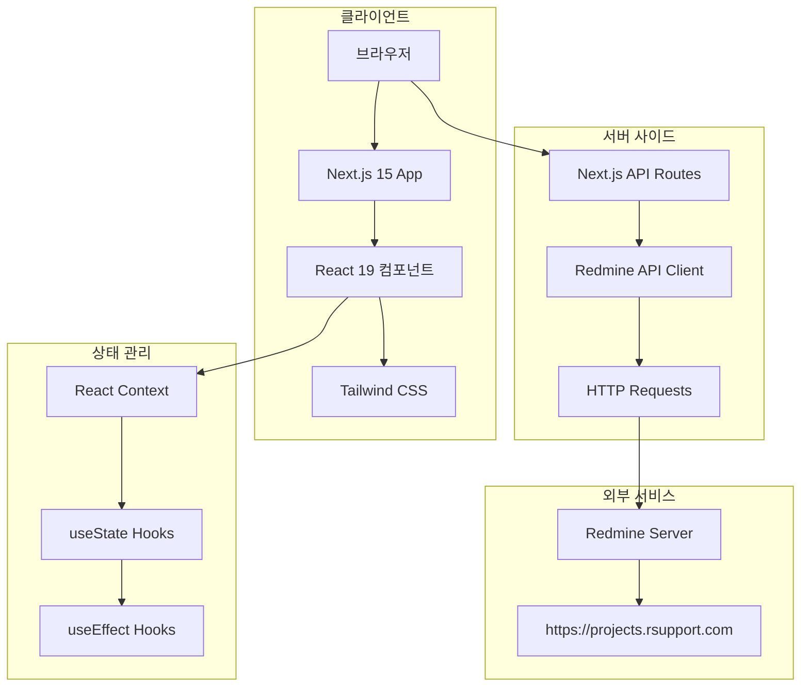
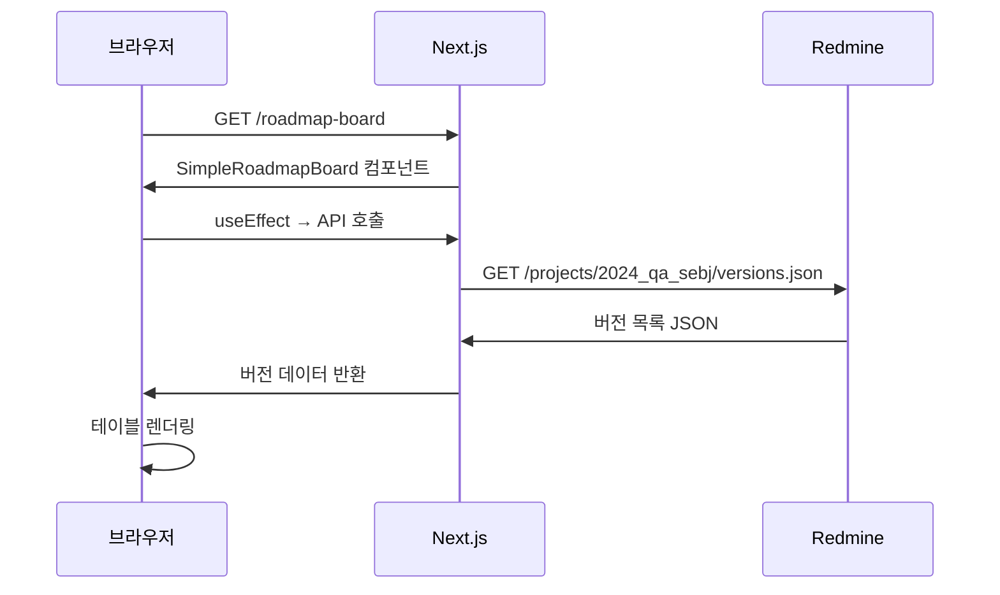
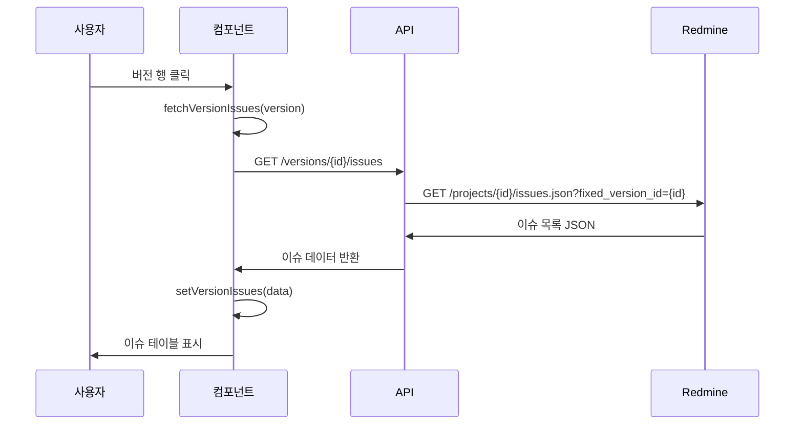

# 시스템 아키텍처

## 🏗️ 전체 시스템 구조



## 🎯 아키텍처 특징

### 1. **SSR + CSR 하이브리드**
- **서버 사이드**: API 라우트에서 Redmine 데이터 fetch
- **클라이언트 사이드**: React로 동적 UI 렌더링

### 2. **컴포넌트 기반 설계**
- **재사용 가능한 컴포넌트**
- **Props를 통한 데이터 전달**
- **Context를 통한 전역 상태 관리**

### 3. **API 프록시 패턴**
```typescript
Browser → Next.js API Route → Redmine API
       ←                   ←
```

**장점:**
- CORS 문제 해결
- API 키 보안
- 에러 처리 중앙화
- 로깅 및 모니터링

## 📊 데이터 플로우

### 1. **버전 목록 조회**


### 2. **버전 클릭 → 이슈 조회**


## 🔧 기술 스택 계층

```
┌─────────────────────────────────────┐
│           프레젠테이션 계층           │
│    React 19 + Tailwind CSS         │
└─────────────────────────────────────┘
┌─────────────────────────────────────┐
│            애플리케이션 계층          │
│         Next.js 15 App Router       │
└─────────────────────────────────────┘
┌─────────────────────────────────────┐
│              비즈니스 계층            │
│     React Context + Custom Hooks    │
└─────────────────────────────────────┘
┌─────────────────────────────────────┐
│               데이터 계층             │
│        Next.js API Routes          │
└─────────────────────────────────────┘
┌─────────────────────────────────────┐
│              외부 연동 계층           │
│          Redmine REST API          │
└─────────────────────────────────────┘
```

## 🚀 렌더링 전략

### **서버 사이드**
- **Static Generation**: 홈페이지 (`/`)
- **Server-Side Rendering**: 게시판 페이지 (`/roadmap-board`)

### **클라이언트 사이드**
- **Dynamic Loading**: 버전 목록, 이슈 목록
- **Interactive Components**: 사이드바, 검색, 필터

## 🔄 상태 관리 패턴

### 1. **전역 상태** (React Context)
- 언어 설정 (ko/en/ja)
- 사용자 인증 정보 (필요시)

### 2. **로컬 상태** (useState)
- 사이드바 열림/닫힘
- 버전 목록 데이터
- 선택된 버전
- 이슈 목록 데이터
- 로딩 상태
- 에러 상태

### 3. **파생 상태**
- 필터링된 버전 목록
- 검색된 이슈 목록

## 🛡️ 보안 고려사항

### 1. **API 키 보호**
```typescript
// ❌ 클라이언트에서 직접 호출 (보안 위험)
fetch('https://redmine.com/api', {
  headers: { 'X-Redmine-API-Key': 'secret-key' }
});

// ✅ 서버 사이드 프록시 (안전)
fetch('/api/redmine/projects/roadmap');
```

### 2. **환경변수 관리**
- `.env.local` (서버 전용)
- `NEXT_PUBLIC_*` (클라이언트 노출 가능)

### 3. **에러 처리**
- API 응답 검증
- 사용자 친화적 에러 메시지
- 에러 경계(ErrorBoundary) 활용

## 📈 성능 최적화

### 1. **코드 스플리팅**
- 라우트 기반 자동 분할
- Dynamic imports (필요시)

### 2. **데이터 캐싱**
- Next.js 자동 캐싱
- React Query 도입 고려 (향후)

### 3. **번들 최적화**
- Tree shaking
- Minification
- Compression

## 🔮 확장성 고려사항

### 1. **모듈화**
- 기능별 컴포넌트 분리
- Custom Hooks 활용
- 유틸리티 함수 분리

### 2. **타입 안전성**
- TypeScript 엄격 모드
- API 응답 타입 정의
- Props 인터페이스 명시

### 3. **테스트 가능성**
- 순수 함수 지향
- Props 의존성 주입
- Mock 가능한 API 레이어